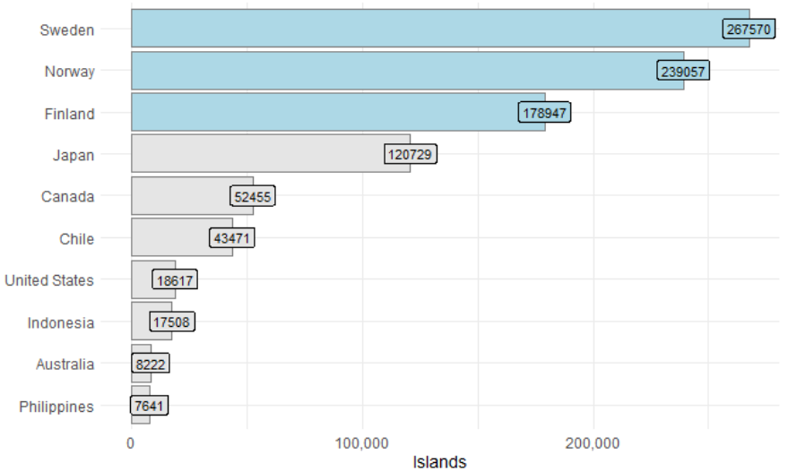

### Data Viz Project

This project use the reticulate package to scrape data on islands from wikipedia.

It shows that Sweden, Norway and Finland have the largest number of islands.

[Github Repo](https://github.com/anl501mavi/data-viz)

